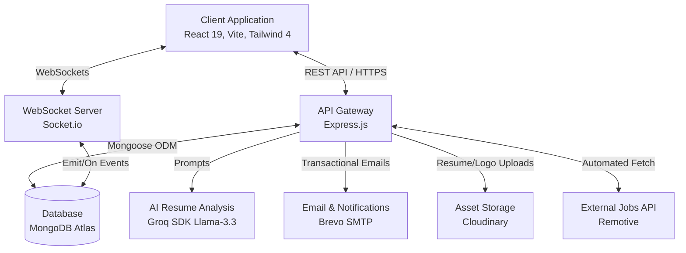
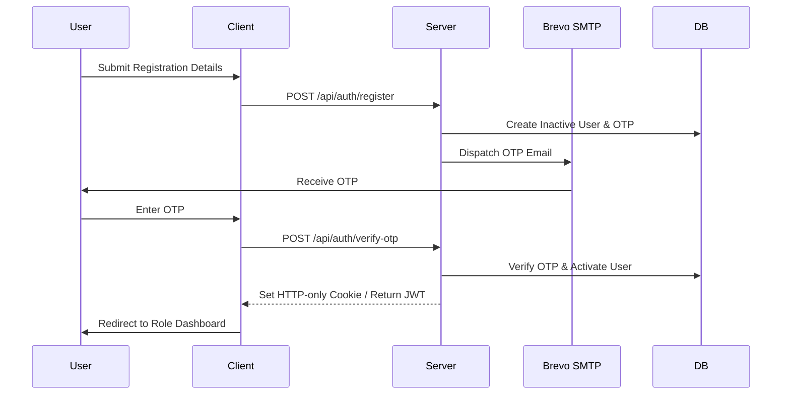
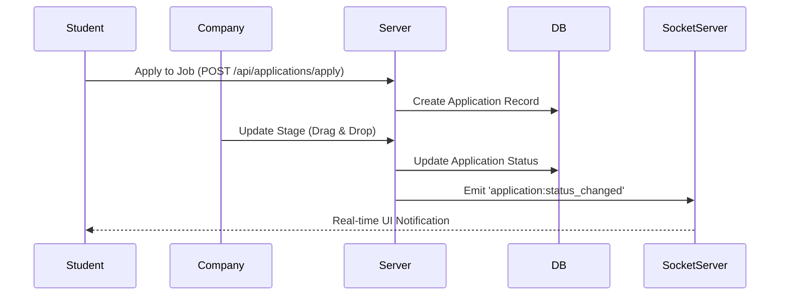

# PlaceIQ - Smart Placement Tracking Portal

**PlaceIQ** is a comprehensive, full-stack campus recruitment platform designed to orchestrate and streamline the placement pipeline for students, companies, and college administrators. Leveraging the MERN stack alongside real-time WebSockets and AI-powered resume analysis, it serves as a centralized hub for modern campus hiring.

## 🔗 Live Deployments

- **Frontend (Client)**: [https://placeiq-frontend.vercel.app](https://placeiq-frontend.vercel.app) *(Update with actual Vercel URL)*
- **Backend (Server)**: [https://placeiq-smart-placement.onrender.com](https://placeiq-smart-placement.onrender.com)

## 🚀 Key Features and Capabilities

PlaceIQ solves the complex coordination problems of college placement cells by supporting four distinct roles, each with a tailored workspace:

1. **Student Portal**
   - **AI Resume Review**: Upload a PDF resume to receive an automated Applicant Tracking System (ATS) score, keyword matches, and improvement suggestions powered by the Groq Llama-3 API.
   - **Online Code Assessment IDE**: A secure, embedded Monaco Editor workspace to complete technical coding rounds directly on the platform.
   - **Job Tracking & External Boards**: Track active applications, check statuses, and browse a live feed of external global opportunities fetched automatically via the Remotive API.
   - **Real-Time Notifications**: Receive instant toast notifications when an application advances in the pipeline or when a new job is posted.

2. **Admin (Training & Placement Officer - TPO)**
   - **Drag-and-Drop ATS Kanban**: Visually track applicants through different interview rounds (Aptitude, Technical, HR) by dragging cards across a React-powered Kanban board.
   - **System Analytics & Data Export**: View live platform metrics and generate comprehensive placement reports using ExcelJS.
   - **Bulk Operations**: Seamlessly upload student rosters via Excel spreadsheets to register hundreds of candidates instantly.
   - **College-Wide Broadcasts**: Push urgent announcements to all online students in real time.

3. **Company (HR) Dashboard**
   - **Job Postings & Filters**: Post vacancies with strict eligibility criteria (e.g., minimum CGPA, specific branches, maximum active backlogs) to automatically filter unqualified candidates.
   - **Interview Pipeline Management**: Add specific interview rounds, input candidate scores, and leave feedback directly on a student's application.
   - **Automated Scheduling**: Schedule interviews that trigger automated Node.js cron jobs to send candidate email reminders with attached `.ics` calendar invites.

4. **Alumni Network**
   - **Referral Postings**: Past graduates can post exclusive referral opportunities for current students, strengthening the college network.

## 🏛️ System Architecture

The system utilizes a modern, decoupled client-server architecture. The React Single Page Application (SPA) communicates with the Node.js Express API via secure, authenticated HTTP requests and persistent WebSockets.



## 🔄 Core Engineering Workflows

### 1. Authentication and Authorization Workflow
PlaceIQ ensures secure access using One-Time Passwords (OTP) and role-based JSON Web Tokens (JWT).
- **Process**: Upon registration, the server generates a 6-digit OTP and dispatches it via Brevo SMTP. Once the user inputs the correct OTP, the server activates the account and issues an HTTP-only cookie and JWT.
- **Security**: React Router `ProtectedRoute` wrappers inspect the JWT payload, preventing students from accessing the TPO dashboard and vice versa.



### 2. Application Pipeline & Real-Time Sync Flow
The Applicant Tracking System (ATS) utilizes a multi-round pipeline to manage candidate progression.
- **Process**: When an Admin or HR representative drags a candidate's card from "Applied" to "Shortlisted", an API request updates the MongoDB `Application` document.
- **Real-Time Hook**: The Express controller subsequently invokes the Socket.io manager, emitting an `application:status_changed` packet directly to that specific candidate's active socket connection, triggering a visual UI update instantly.



## 📁 Repository Directory Structure

```text
smart_placement_tracker/
├── client/                 # React 19 SPA (Vite)
├── server/                 # Node.js Express API
├── package.json            # Root configuration and workspace scripts
└── render.yaml             # Render deployment configuration
```

## 🛠️ Global Setup and Local Installation

To run the entire stack locally for development, follow these steps:

1. **Install Global Dependencies**
   From the root project directory, execute the universal dependency installer:
   ```bash
   npm run install:all
   ```

2. **Configure Environment Variables**
   - **Backend**: Navigate to `server/` and create a `.env` file (refer to the Backend documentation for keys like `MONGO_URI`, `GROQ_API_KEY`, etc.).
   - **Frontend**: Navigate to `client/` and configure the `.env` file (e.g., `VITE_API_URL=http://localhost:5000/api`).

3. **Launch Development Servers Concurrenty**
   Open two terminal windows:
   - **Terminal 1 (Backend)**: `npm run dev:server` (Starts Express API on port 5000)
   - **Terminal 2 (Frontend)**: `npm run dev:client` (Starts Vite React client on port 5173)

---

## 📚 Detailed Sub-System Documentation

For an exhaustive, technical deep-dive into the specific architectural components, please refer to the dedicated engineering manuals below:

- 🖥️ **[Frontend Engineering Documentation](client/README.md)** - Details on TanStack Query, Tailwind CSS, Monaco IDE setup, and React Layouts.
- ⚙️ **[Backend Engineering Documentation](server/README.md)** - Details on Mongoose Schemas, API Endpoint references, Node-cron schedulers, and Socket.io events.
