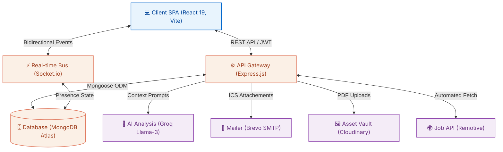

# 🚀 PlaceIQ - Smart Placement Tracking Portal

[](#)
[](#)
[](#)
[](#)

🔗 **Frontend Live Deploy:** [placeiq-frontend.vercel.app](https://placeiq-frontend.vercel.app/)  
🔗 **Backend Live Deploy:** [placeiq-smart-placement.onrender.com](https://placeiq-smart-placement.onrender.com/)

Welcome to **PlaceIQ**, a comprehensive, enterprise-grade campus recruitment platform engineered to orchestrate and streamline the placement pipeline. Built on the modern MERN stack, it serves as a highly scalable centralized hub unifying students, corporate HRs, and university administrators.

PlaceIQ goes beyond standard CRUD applications by injecting real-time WebSockets for instant UI feedback, automated Node-cron background processing for synchronization, and state-of-the-art LLM capabilities via the Groq API for intelligent resume parsing.

---

## 💎 Core Platform Features

*   **🤖 AI-Powered Resume Reviews:** Students upload PDF resumes which are streamed, parsed (`pdf-parse`), and evaluated by the **Groq Llama-3.3 API** against job descriptions, returning an ATS score, keyword matches, and formatted actionable feedback.
*   **🗂️ Drag-and-Drop ATS Kanban:** Training and Placement Officers (TPOs) and Company HRs visually transition candidates through multi-round interview pipelines using a fluid `@dnd-kit` React Kanban board.
*   **💻 Secure Code Assessment IDE:** A standalone, distraction-free React route embeds a **Monaco Editor** workspace, allowing candidates to compile code and pass test cases directly within the browser.
*   **⚡ Real-Time Socket Infrastructure:** The UI is hyper-responsive. When a student is shortlisted or a new job is approved, `socket.io` immediately dispatches glassmorphic toast notifications across all connected client browsers without a page refresh.
*   **⏱️ Automated Cron Scheduling:** Embedded `node-cron` engines autonomously query the external Remotive API every 6 hours for remote jobs, and execute a daily 8:00 AM sweep to email candidates their upcoming interview `.ics` calendar invites via **Brevo SMTP**.

---

## 🗺️ Unified System Architecture

The monorepo operates a decoupled architecture. The Vite-bundled React frontend communicates with the Express Gateway securely via HTTP-only Cookies and JWTs.



---

## 📂 Repository Workspace Structure

The project is structured as a unified monorepo to simplify dependency management and deployment pipelines.

```text
smart_placement_tracker/
├── client/                 # Premium React 19 Frontend (Vite)
│   ├── src/api/            # Axios request interceptors
│   ├── src/pages/          # Role-isolated routing components
│   └── package.json        # Frontend specific dependencies
├── server/                 # High-Performance Node.js API
│   ├── controllers/        # Core business and AI logic
│   ├── models/             # Mongoose relational schemas
│   ├── utils/              # Cron jobs and Socket managers
│   └── package.json        # Backend specific dependencies
├── package.json            # Root workspace scripts (npm run install:all)
└── render.yaml             # Render cloud infrastructure mapping
```

---

## 🚀 Quick Start & Installation

To spin up the entire MERN stack locally for development:

1. **Install Universal Dependencies**
   Run the root installer to map dependencies in both client and server directories:
   ```bash
   npm run install:all
   ```

2. **Establish Environment Configurations**
   Copy the provided `.env` templates located in the respective backend and frontend documentation into your local `server/` and `client/` directories.

3. **Launch the Development Servers**
   Open two separate terminal instances to boot the stack concurrently:
   - **Terminal 1 (Backend):** `npm run dev:server` (Starts API on `localhost:5000`)
   - **Terminal 2 (Frontend):** `npm run dev:client` (Starts UI on `localhost:5173`)

---

## 📖 Deep-Dive Engineering Manuals

For granular details on route structures, API endpoints, database schema constraints, and React component hierarchies, consult the core engineering manuals below:

*   🖥️ **[Client (Frontend) Engineering Manual](./client/README.md)**
*   ⚙️ **[Server (Backend) Engineering Manual](./server/README.md)**
