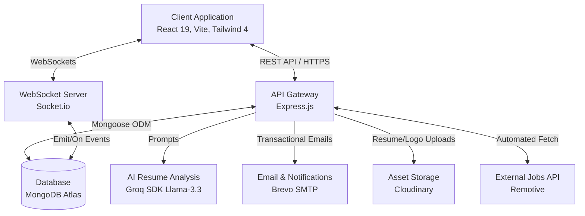
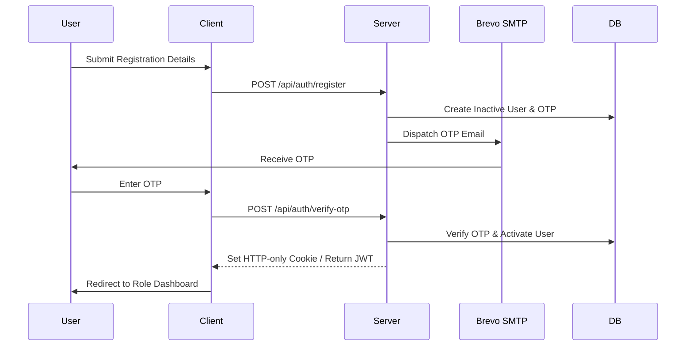
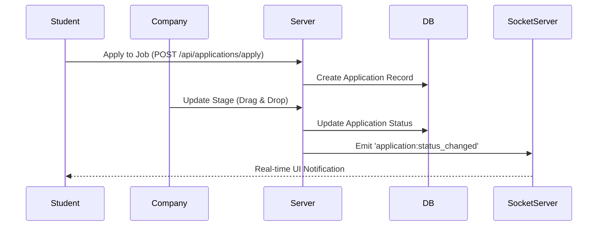

# PlaceIQ - Smart Placement Tracking Portal

## System Overview

PlaceIQ is a comprehensive, full-stack campus recruitment platform designed to streamline the placement process for students, companies, and administrators. Built on the MERN stack (MongoDB, Express, React, Node.js), it integrates real-time communication, automated background processing, and AI-powered resume analysis.

## High-Level Architecture

The system utilizes a client-server architecture with an independent React Single Page Application (SPA) communicating with a Node.js Express API.



## Core Workflows

### Authentication and Authorization Flow

PlaceIQ implements a robust Role-Based Access Control (RBAC) system utilizing JSON Web Tokens (JWT) and One-Time Passwords (OTP).



### Application Pipeline Flow

The Applicant Tracking System (ATS) features a multi-round pipeline utilizing a Kanban board interface.



## Repository Structure

```text
smart_placement_tracker/
├── client/                 # React 19 SPA (Vite)
├── server/                 # Node.js Express API
├── package.json            # Root configuration and workspace scripts
└── render.yaml             # Deployment configuration
```

## Global Setup Instructions

1. **Install Dependencies**
   Run the following command in the root directory to install dependencies for both the client and server:
   ```bash
   npm run install:all
   ```

2. **Environment Configuration**
   Configure the `.env` files in both the `client` and `server` directories based on the provided templates in their respective documentation.

3. **Start Development Servers**
   Open two terminal windows:
   - Terminal 1 (Backend): `npm run dev:server`
   - Terminal 2 (Frontend): `npm run dev:client`

## Detailed Documentation

For an in-depth understanding of the specific sub-systems, refer to the following technical manuals:

- [Frontend Engineering Documentation](client/README.md)
- [Backend Engineering Documentation](server/README.md)
