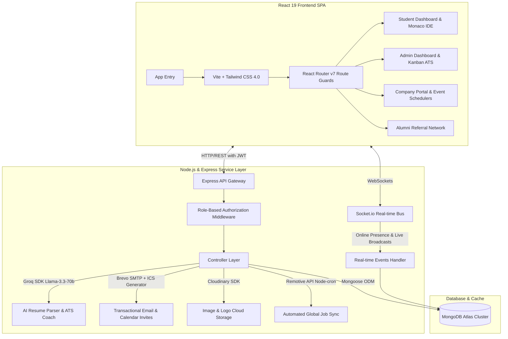

# 🎯 PlaceIQ: AI-Powered Smart Placement Tracking Portal

> **Senior Engineering Documentation**  
> *A unified full-stack campus recruitment platform that leverages AI, WebSockets, background automation, and granular role-based controls to orchestrate and streamline college placement pipelines.*

---

## 🏛️ System Architecture Overview

PlaceIQ is engineered as a unified monorepo leveraging the **MERN (MongoDB, Express, React, Node.js)** architecture. The system is divided into two primary sub-systems—`client` (Frontend SPA) and `server` (Backend REST & WebSocket API)—integrating cloud infrastructure and AI models for advanced workflows.



---

## 🚀 Key Architectural Features

PlaceIQ is built to solve the complex coordination problems of college placement cells. It supports four distinct roles:
1. **Student**: Analyzes resumes with AI, practices code assessments, tracks interview pipelines, views external jobs, and communicates in real time.
2. **Admin (Training & Placement Officer - TPO)**: Operates the Kanban ATS, runs analytics, coordinates campus visits, broadcasts college-wide placements, and exports data.
3. **Company (HR)**: Posts job openings, verifies candidates, creates code/MCQ assessments, and directly updates application rounds.
4. **Alumni**: Posts referrals, supports current students, and shares industry opportunities.

---

## 🔄 Core End-to-End System Workflows

Below are the detailed engineering workflows demonstrating how data propagates across the database, client interfaces, WebSockets, and third-party APIs.

### 1. Secure Authentication & Verification Workflow (with OTP)
```
[User Registration] ──> [Generate Random 6-Digit OTP] ──> [Send OTP via Brevo SMTP]
                                                                    │
[Dashboard Access] <── [Verify OTP & Issue JWT Cookie] <── [User Inputs Correct OTP]
```
* **Step 1:** User initiates registration or login on the React frontend.
* **Step 2:** Express server generates a secure, time-limited 6-digit OTP stored in the DB.
* **Step 3:** A transactional email is sent instantly using **Brevo (Nodemailer)**.
* **Step 4:** The user inputs the OTP. Upon success, the server issues a signed JSON Web Token (JWT), containing the user ID and role, which is stored in local storage and appended as an authorization header in interceptors.

### 2. Job Creation, Eligibility Filter, and Search Workflow
* **Step 1:** A verified Company HR posts a job specifying eligibility criteria: Branch restrictions, minimum CGPA, and maximum allowed active backlogs.
* **Step 2:** The Job document is indexed into MongoDB.
* **Step 3:** A real-time **Socket.io** event (`job:new_posted`) is broadcast to all active student sockets, rendering an instantaneous toast notification.
* **Step 4:** When students browse jobs, the backend dynamically compares the student’s profile metrics (`CGPA`, `branch`, `backlogs`) against the job's strict requirements, blocking unqualified applicants at the UI and API gateways.

### 3. Drag-and-Drop ATS Kanban & Interview Pipeline
```
[Student Applies] ──> [ATS Kanban Card Placed in 'Applied']
                              │
                    [Admin / HR Drags Card] ──> (Socket.io Trigger)
                              │
                    ┌─────────┴─────────┐
                    ▼                   ▼
      [Student Receives Toast]   [Interview Round Created]
```
* **Step 1:** When a student applies, an `Application` document is generated with status `applied` and a default `rounds` array.
* **Step 2:** On the Admin/Company Pipeline page, applicant profiles are rendered as cards inside a **`@dnd-kit` React Kanban board**.
* **Step 3:** Dragging a candidate’s card from `Applied` to `Technical Interview` triggers a `PATCH` request, updating the application state.
* **Step 4:** The controller invokes the real-time manager, dispatching an `application:status_changed` Socket.io packet to the candidate. A floating, micro-animated glassmorphic toast pops up on the student's dashboard.

### 4. AI-Powered Resume Parsing & ATS Scoring
* **Step 1:** The student uploads their resume PDF. The file is uploaded to **Cloudinary** and a secure URL is returned.
* **Step 2:** The student clicks "Analyze Resume". The server fetches the PDF buffer and processes the text using `pdf-parse`.
* **Step 3:** The parsed text is parsed into a structured prompt and analyzed by the **Groq SDK** using the **Llama-3.3-70b-versatile** model.
* **Step 4:** The LLM returns a strict JSON payload mapping formatting scores, keyword matches, missing skills, and overall ATS suggestions.
* **Step 5:** The server updates the candidate's `StudentProfile` database record and returns the analysis data to the client, which renders charts using **Recharts**.

### 5. Automated Global Job Syncing (Remotive Integration)
* **Step 1:** A **`node-cron`** scheduler boots up with the Express server, configured to query the Remotive API every 6 hours (`0 */6 * * *`).
* **Step 2:** External opportunities are fetched, sanitized, and de-duplicated by matching their API reference IDs.
* **Step 3:** If a job lacks a company logo, the server runs a fallback backfill controller to retrieve logos or inject clean brand initials.
* **Step 4:** Placed under the `/student/external-jobs` route, students search and filter hundreds of verified remote opportunities.

### 6. Interactive Coding IDE & Assessment Workspace
```
[Company Creates Assessment] ──> [Student Enters Workspace (Monaco IDE)]
                                                │
                                    [Monaco Code Editor Input]
                                                │
                                      [Code Compilation &]
                                      [Test Case Evaluation]
                                                │
[Application State Autoclose] <── [Scores Persisted & Logged]
```
* **Step 1:** Company HR designs a coding round on the portal, creating multiple coding challenges with hidden and public test cases.
* **Step 2:** Eligible students launch the secure **AssessmentWorkspace** (which strips out sidebars and navigation panels for full-screen focus).
* **Step 3:** Code is typed inside an embedded **Monaco Editor** interface with syntax highlighting and auto-completion.
* **Step 4:** The code, along with compiler parameters, is processed, tested against all test cases, and automatically scored.
* **Step 5:** The score is immediately written into the corresponding `rounds` index of the `Application` document, allowing recruiters to filter and select candidates on their dashboard.

### 7. Automated Calendar Sync & Daily Reminders (.ics)
* **Step 1:** Once an interview round is scheduled (TPO/Company assigns a date, time, and room), the server generates a standardized **iCalendar (`.ics`)** event.
* **Step 2:** The server fires an email confirmation using Brevo SMTP, attaching the `.ics` calendar invitation file. When opened, the event auto-syncs with the student's Google, Apple, or Outlook Calendars.
* **Step 3:** Every morning at 8:00 AM, another `node-cron` job scans the database for interviews scheduled within the next 24 hours.
* **Step 4:** For any matching rounds where a reminder hasn't been sent, it triggers a reminder email, ensuring zero missed interviews.

---

## 📁 Repository Directory Structure

```
smart_placement_tracker/
├── package.json              # Monorepo configuration and script runners
├── render.yaml               # Infrastructure configuration for deployment
├── client/                   # React Single-Page Application (SPA)
│   ├── src/
│   │   ├── api/              # Axios instance and interceptors configuration
│   │   ├── components/       # Layout structures, sidebars, protected routes
│   │   ├── hooks/            # Context hooks (useAuth, useSocket)
│   │   ├── pages/            # Role-specific workspaces (Admin, Student, Company, Alumni)
│   │   └── main.jsx          # App entry point
│   ├── tailwind.config.js    # Tailwind 4.0 configuration
│   └── vite.config.js        # Vite bundling engine
└── server/                   # Node.js + Express API Backend
    ├── config/               # DB connection and third-party credential configs
    ├── controllers/          # Endpoint controllers containing core business logic
    ├── middleware/           # RBAC checks, JWT parsers, global error handlers
    ├── models/               # Mongoose schemas (User, StudentProfile, Application, etc.)
    ├── routes/               # API route definitions
    └── utils/                # Cron schedulers, AI prompts, mailers, socket setup
```

---

## 🛠️ Global Setup & Local Installation

Follow these steps to spin up the entire monorepo stack locally for active development.

### Prerequisites
* Ensure **Node.js** (v18 or higher) and **npm** are installed.
* Access to a running **MongoDB** instance (local server or Atlas cluster).
* API keys for **Groq**, **Brevo (SMTP)**, and **Cloudinary** (refer to the Backend README to set these up).

### 1. Clone & Install Dependencies
From the root project directory, execute the universal dependency installer:
```bash
npm run install:all
```
*This command runs npm install inside both `/client` and `/server` directories sequentially.*

### 2. Configure Environment Variables
You must set up variables for both frontend and backend sub-folders:
* **Backend:** Navigate to `/server` and copy `.env.example` to `.env` (Populate keys like `MONGO_URI`, `GROQ_API_KEY`, etc.).
* **Frontend:** Navigate to `/client` and configure `.env` (e.g. `VITE_API_URL=http://localhost:5000/api`).

### 3. Launch Development Servers
To run both the React Vite frontend and the Express backend concurrently:
* **Terminal 1 (Backend Dev Server):**
  ```bash
  npm run dev:server
  ```
* **Terminal 2 (Frontend Dev Server):**
  ```bash
  npm run dev:client
  ```
The client dashboard will boot on [http://localhost:5173](http://localhost:5173) and hot-connect to the backend listening on [http://localhost:5000](http://localhost:5000).

---

## 🚀 Development & Production Scripts

The root `package.json` includes several convenience scripts:

| Command | Action |
|:---|:---|
| `npm run install:all` | Installs dependencies in both the backend and frontend folders. |
| `npm run dev:server` | Starts the Express server under local `nodemon` for auto-reloading. |
| `npm run dev:client` | Launches the local Vite development web server for React. |
| `npm run build:client` | Compiles a production-ready, optimized bundle for the React client. |
| `npm run start` | Boots up the backend Node server for production use. |

---

> **For specific technical details, continue reading:**
> * 🖥️ **[Frontend Documentation (Client)](file:///c:/Projects/smart_placement_tracker/client/README.md)**  
> * ⚙️ **[Backend Documentation (Server)](file:///c:/Projects/smart_placement_tracker/server/README.md)**
