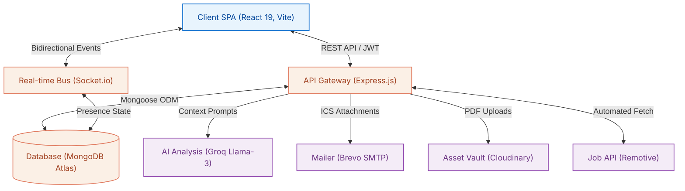
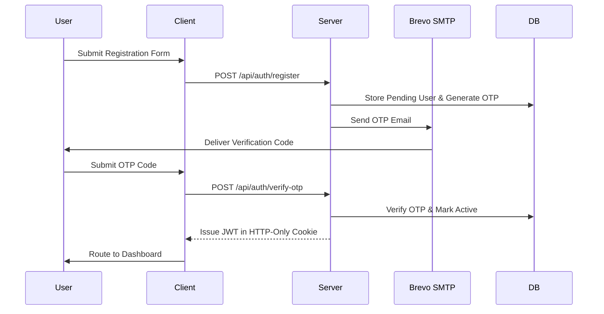
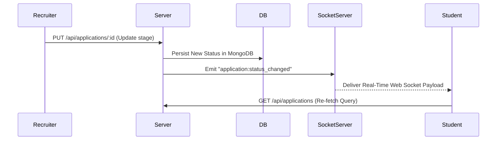

# PlaceIQ - Smart Placement Tracking Portal

[](#)
[](#)
[](#)
[](#)

Live Frontend Deployment (Vercel): https://smart-placement-tracker.vercel.app  
Live Backend Deployment (Render): https://placeiq-smart-placement.onrender.com  

PlaceIQ is a comprehensive, full-stack campus recruitment platform designed to coordinate and automate the placement lifecycle. Developed on the MERN stack (MongoDB, Express, React, Node.js), it acts as a unified hub connecting students, Training & Placement Officers (TPOs), corporate HR representatives, and alumni.

By combining real-time communication via WebSockets, background automation using scheduled crons, and advanced LLM reasoning through the Groq API, PlaceIQ solves the coordination problems inherent in traditional university hiring drives.

---

## Key Architectural Capabilities

* **Artificial Intelligence Resume Analysis**: Integrates the Groq Llama-3.3 API to review uploaded resumes. The backend extracts text from PDF files, passes it to the LLM alongside a structured prompt, and returns a calculated ATS score, matched key terms, and suggested bullet point improvements.
* **Applicant Tracking System Kanban**: Provides TPOs and recruiters with interactive drag-and-drop boards to track applications through multiple interview rounds (Aptitude, Technical, HR).
* **Browser-Based Programming IDE**: Features an integrated Monaco Editor workspace allowing students to complete technical programming assessments directly on the portal, validating submissions against custom test suites.
* **Real-Time Notification Architecture**: Built on Socket.io, the application broadcasts state changes (e.g. status updates, new job postings, campus-wide announcements) to active browser clients instantly.
* **Autonomous Task Schedulers**: Powered by node-cron, the system crawls the Remotive API every 6 hours for external opportunities and triggers a daily morning sweep to email candidates their upcoming interview details accompanied by ICS calendar files.

---

## System Topology

The platform operates on a decoupled client-server architecture. The React single-page application (SPA) communicates with the Node.js API server over secure HTTPS, maintaining a persistent TCP socket connection for event streaming.



---

## Core Engineering Workflows

### 1. Unified Authentication Flow
The system mandates email verification using One-Time Passwords (OTP) and issues JSON Web Tokens (JWT) for session management.
* **Registration**: User registers with details, generating a pending user record in MongoDB. The backend generates a 6-digit OTP and sends it via Brevo SMTP.
* **Activation**: When the user enters the OTP, the user is activated, and a JWT is issued via secure, HTTP-only cookies.
* **Authorization**: The JWT claims include user roles, checked dynamically by client-side router guards and server-side middleware.



### 2. Application Pipeline & Status Synchronization
Recruiter actions on the Kanban pipeline are updated instantly in the database and synchronized with the student's browser UI.
* **Update Hook**: Recruiter drags a card in the Kanban UI. The frontend issues a `PUT /api/applications/:id` request.
* **Persistence & Broadcast**: The database updates, and the server fires an `application:status_changed` event through Socket.io targeting the student's personal socket room.
* **Reconciliation**: The client-side listener intercepts the socket event, displays a Toast notification, and triggers TanStack Query to refetch the local application cache.



---

## Directory Organization

```text
smart_placement_tracker/
├── client/                 # React 19 single-page application
│   ├── src/api/            # Axios instance and security interceptors
│   ├── src/pages/          # Views grouped by role-based workspaces
│   └── package.json        # Frontend package configuration
├── server/                 # Express REST API & Socket.io server
│   ├── controllers/        # Logical controllers (Auth, Jobs, Resume AI)
│   ├── models/             # Mongoose schemas (User, StudentProfile, Job)
│   ├── utils/              # Cron jobs, emails, and WebSocket handlers
│   └── package.json        # Backend package configuration
├── package.json            # Monorepo configuration and workspace scripts
└── render.yaml             # Render infrastructure deployment specification
```

---

## Development Setup

Follow these steps to configure and run the application in a local environment:

### 1. Install Dependencies
Run the install command from the root workspace directory to install dependencies for the client, server, and workspace wrapper:
```bash
npm run install:all
```

### 2. Set Up Environment Files
Create a `.env` file in the `server/` directory and configure the environment variables as specified in the [Server Documentation](server/README.md). Similarly, configure variables in `client/` as noted in the [Client Documentation](client/README.md).

### 3. Start Development Servers
Open two terminal windows from the root folder:
* **Terminal 1**: Run `npm run dev:server` to boot the backend API on port 5000.
* **Terminal 2**: Run `npm run dev:client` to boot the Vite frontend dev server on port 5173.

---

## Engineering Manuals

For granular details on API routing definitions, client routing hierarchies, or Mongoose schema keys, please consult the dedicated manuals:
* **[Frontend Client Documentation](client/README.md)**
* **[Backend Server Documentation](server/README.md)**
