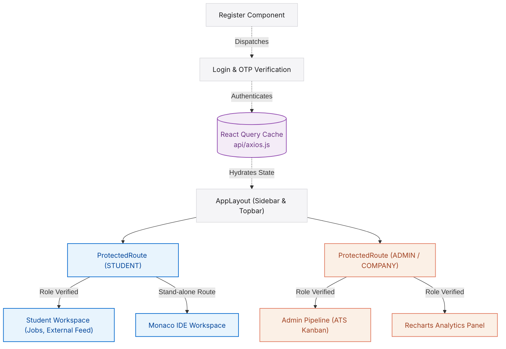

# PlaceIQ Client - React 19 Frontend

[](https://react.dev/)
[](https://vite.dev/)
[](https://tailwindcss.com/)
[](https://tanstack.com/query)
[](https://socket.io/)

Live Production Deployment (Vercel): https://smart-placement-tracker.vercel.app

This is the frontend client application for the PlaceIQ Smart Placement Tracking Portal. It is structured as a React 19 Single Page Application (SPA), bundled with Vite, and designed with a responsive, glassmorphic visual system built using Tailwind CSS. 

The client handles user interactions across four discrete roles: students, training officers, company recruiters, and alumni, with role-based routing, real-time message feeds, data visualization dashboards, and an integrated coding sandbox.

---

## Core Architecture Highlights

### 1. Role-Based Route Protection (src/components/common/ProtectedRoute.jsx)
Router security is enforced at the component level:
* **Permission Constraints**: Wraps protected view components, verifying user authentication status and matching the user's role against permitted claims (e.g. `roles={['admin', 'company']}`).
* **Interception**: Unauthenticated navigation attempts redirect to `/login`, while unauthorized operations redirect users to `/unauthorized` with history stack replacements to avoid loop states.

### 2. Cached State Synchronization (src/api/axios.js)
Leverages TanStack React Query to decouple state synchronization from standard page refreshes:
* **Request Interceptor**: Axios automatically parses `localStorage` for active JWTs on every outbound HTTP call and appends it to the authorization headers.
* **Response Interceptor**: A wrapper checks incoming HTTP codes. In case of `401 Unauthorized` responses, it automatically flushes local caches and logs the user out.
* **Declarative Data Fetching**: Employs React Query mutations and automatic invalidations to keep components synchronized with backend state changes in real time.

### 3. Persistent Real-Time Streams (src/hooks/useSocket.jsx)
* **Dedicated WebSocket Client**: Establishes a persistent TCP tunnel with the backend upon successful login.
* **Personalized Channel Broadcasts**: Subscribes users to channels specific to their user ID (for application changes or private chat messages) and class-wide channels (for campus announcement broadcasts).

### 4. Technical Assessment IDE (src/pages/student/AssessmentWorkspace.jsx)
* **Monaco Integration**: Integrates the Monaco Editor (`@monaco-editor/react`) inside a dedicated coding interface.
* **State Sandbox**: Manages code buffers, language switches (Java, Python, C++), and displays execution test-case evaluations in a side pane, isolated from standard layouts.

---

## Navigation & Page Routing Topology

This diagram outlines the routing boundaries, authentication state hydrations, and view rendering targets:



---

## Codebase Directory Layout

```text
client/src/
├── api/              # Axios configuration and global JWT interceptors
├── assets/           # Static media assets (brand logo, vector images)
├── components/       # Reusable components
│   ├── common/       # ProtectedRoute, Spinner, Toast notifications
│   ├── layout/       # Sidebar, Topbar, AppLayout structures
│   └── ui/           # Custom buttons, modals, badges, input controls
├── hooks/            # useAuth, useSocket, useTheme context configurations
├── lib/              # Client utilities and class mergers (tw.js)
├── pages/            # Role-isolated routing components
│   ├── admin/        # Dashboard, Analytics, Pipeline, Campaigns, Students
│   ├── company/      # Dashboard, PostJob, Assessments, Events
│   └── student/      # Dashboard, Jobs, Applications, Profile, AssessmentIDE
├── App.css           # Global visual styling rules
├── App.jsx           # Master route layout definitions
└── main.jsx          # Entry point mounting context providers
```

---

## Command Reference

Run the following commands inside the `client/` directory for local development:
* `npm run dev`: Starts the Vite development server on `http://localhost:5173`.
* `npm run build`: Bundles the application assets into minified production files in `dist/`.
* `npm run preview`: Spins up a local server to test the production build build outputs.
* `npm run lint`: Performs static code checks to verify code formatting guidelines.
