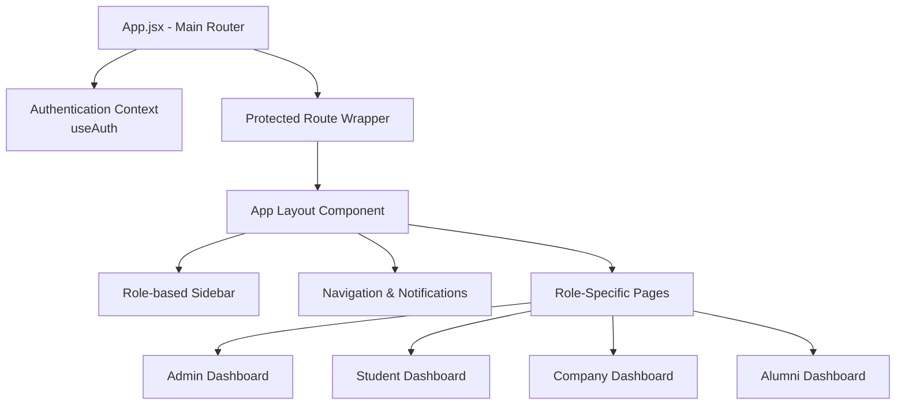
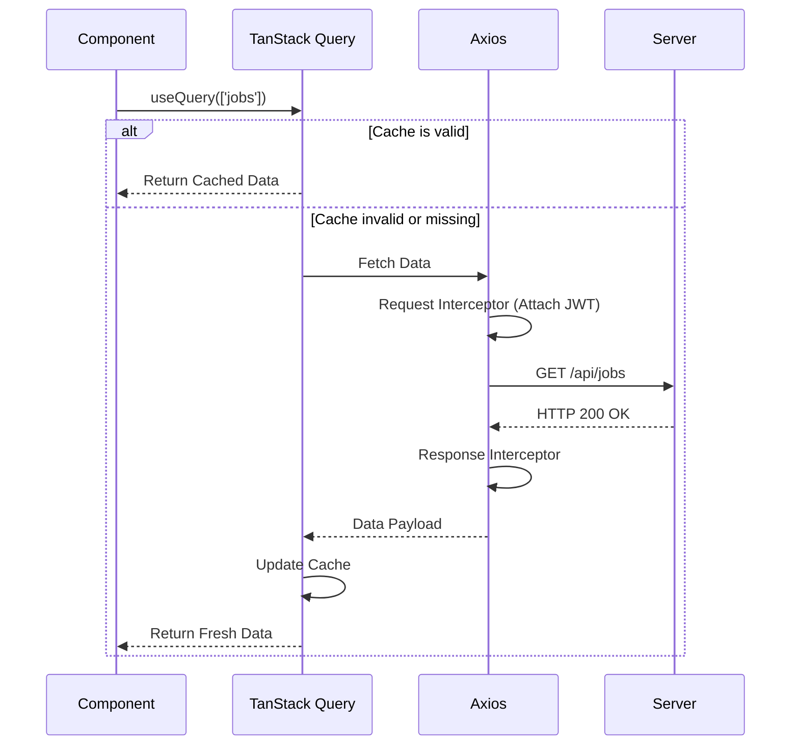
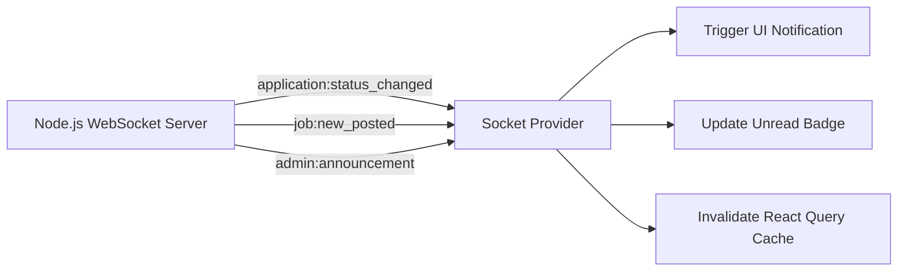

# PlaceIQ Frontend Engineering Documentation

The frontend of PlaceIQ is a modern, high-performance Single Page Application (SPA) built to serve as the user-facing command center for students, corporate HRs, and university administrators. It leverages strict typed routing, real-time WebSockets, and declarative data fetching to ensure a seamless user experience.

## 🔗 Live Deployment
- **Client Application**: [https://placeiq-frontend.vercel.app](https://placeiq-frontend.vercel.app) *(Update with actual Vercel URL)*

## 🛠️ Core Technology Stack

- **Framework**: React 19 optimized and bundled via **Vite**.
- **Aesthetic Styling**: Tailwind CSS 4.0 paired with Framer Motion for fluid micro-animations and a glassmorphic design system.
- **State & Data Caching**: TanStack React Query (v5) handles API fetching, request deduplication, and automatic background refetching.
- **Code Assessment Workspace**: `@monaco-editor/react` embeds a full-featured code editor directly into the browser for technical interview rounds.
- **Pipeline Management**: `@dnd-kit/core` powers the drag-and-drop Applicant Tracking System (ATS) Kanban boards.
- **Visual Analytics**: Recharts generates dynamic data visualizations for administrative dashboards.
- **Real-Time Connectivity**: `socket.io-client` maintains a persistent connection to the server for instant UI alerts.

## 🏛️ Frontend Architecture and Routing

The application implements a modular component architecture. Security and role-based permissions are enforced right at the routing layer within `App.jsx`. 

- **Layout Wrapper**: The `AppLayout` component constructs the core UI skeleton, managing the responsive Sidebar and the Topbar (which houses notifications and user profiles). Sub-routes render dynamically within this frame.
- **Route Guards**: A custom `ProtectedRoute.jsx` component intercepts route changes, verifying the user's role against the required permissions before rendering the view.



## 🔄 Data Fetching and State Synchronization

To ensure the user interface is always synced with the database without manual browser refreshes, the client utilizes TanStack Query alongside a configured Axios instance.

- **Axios Interceptors**: Automatically inject the JWT token from `localStorage` into the Authorization headers of outgoing requests. If a `401 Unauthorized` response is received, the interceptor immediately clears stale data and redirects the user to the login screen.
- **Query Invalidation**: When a user performs an action (e.g., submitting an application), mutation handlers automatically invalidate specific query caches (like `['applications']`), triggering an immediate UI update.



## ⚡ Real-Time WebSocket Implementation

The `useSocket` context provider initializes the Socket.io connection the moment a user authenticates. 

- **Room Subscriptions**: Students join a private room matching their User ID, while administrators join a global `room:admins` channel.
- **Event Handling**: 
  - `application:status_changed`: Displays a toast notification when an application advances.
  - `job:new_posted`: Alerts all online students of a newly approved job opportunity.
  - `admin:announcement`: Triggers a high-priority banner for college-wide broadcasts.



## 📁 Directory Structure

```text
client/src/
├── api/              # Axios configuration and global interceptors
├── assets/           # Static media assets
├── components/       # Reusable UI elements
│   ├── common/       # Shared components (ProtectedRoute)
│   ├── layout/       # Structural components (AppLayout, Sidebar, Topbar)
│   └── ui/           # Base glassmorphic elements (Buttons, Inputs, Modals)
├── hooks/            # Custom React context hooks (useAuth, useSocket)
├── lib/              # Utility functions (Tailwind class mergers via clsx)
├── pages/            # Routable view components cleanly separated by role
└── main.jsx          # Application entry point and Context Providers
```

## 💻 Development Commands

Navigate to the `client/` directory and use the following scripts:

- `npm run dev`: Starts the Vite development server on port 5173 with Hot Module Replacement (HMR).
- `npm run build`: Compiles and minifies the application into the `/dist` directory for production deployment.
- `npm run preview`: Serves the production build locally to test performance and routing before deployment.
- `npm run lint`: Executes ESLint rules to maintain code quality.
