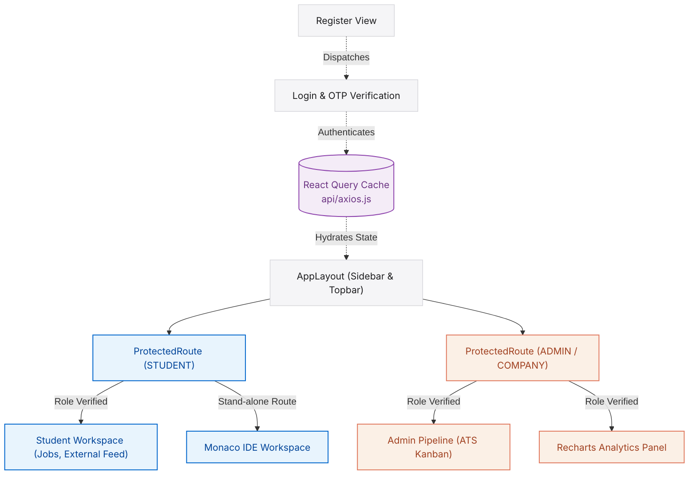

# PlaceIQ Client - React 19 Frontend

[](https://react.dev/)
[](https://vite.dev/)
[](https://tailwindcss.com/)
[](https://tanstack.com/query)
[](https://socket.io/)

Live Production Deployment: https://placeiq-frontend.vercel.app

Welcome to the PlaceIQ Frontend Client. This is a premium, enterprise-grade React 19 Single Page Application (SPA) designed to serve as the user-facing command center for the PlaceIQ Smart Placement Tracking Portal. 

The application is built around modern UI principles, strict layout boundaries, precise typography hierarchies, and fluid animations. It operates dynamically in multi-role environments to coordinate communication and action between students, administrators, company HR representatives, and alumni.

---

## Technical Stack & Dependencies

* **Framework Core**: React 19 bundled and optimized with Vite 8.0.
* **Global State & Cache**: TanStack React Query v5 for API caching, request deduplication, and automated background data revalidation.
* **Real-Time Layer**: socket.io-client maintaining persistent connections for live alerts and chat message deliveries.
* **Component UI Sandbox**: Monaco Editor (@monaco-editor/react) configured as an in-browser code editor.
* **Drag-and-Drop Engines**: @dnd-kit/core and @dnd-kit/sortable for Kanban status cards.
* **Styling & Presentation**: Tailwind CSS v4.0 for a custom, glassmorphic layout, coupled with Framer Motion for smooth interface transitions.
* **Charts**: Recharts for rendering analytics and placement statistics.

---

## Detailed Directory and File Reference

This section details the structure and responsibilities of every file and folder inside the `client/src` directory.

### 1. API Service Configurations (src/api/)
* **axios.js**: Sets up the global Axios client. Configures request interceptors to automatically fetch JWT tokens from localStorage and inject them into the Authorization headers of outgoing requests. Configures response interceptors to listen for HTTP 401 Unauthorized codes, which trigger immediate cache clear actions, token deletion, and routing redirections to the login screen.

### 2. Layout & Shell Components (src/components/layout/)
* **AppLayout.jsx**: Serves as the master structure of the dashboard layout. Binds the Sidebar and Topbar interfaces, managing the rendering region for nested child routes inside the application grid.
* **Sidebar.jsx**: A sidebar navigator containing links to views. Evaluates the authenticated user's role to dynamically render links. Features fluid collapse actions and active navigation states.
* **Topbar.jsx**: The top bar of the application layout. Renders the application logo, page titles, active notification counts, a drop-down notification message log, and the profile avatar menu.

### 3. Shared & Security Wrappers (src/components/common/)
* **ProtectedRoute.jsx**: A router guard wrapper. Evaluates user sessions using the useAuth hook and verifies if the user's role matches the required permissions before rendering child routes. Unauthorized users are routed to a dedicated access alert page.

### 4. Basic UI Atoms (src/components/ui/)
* **Badge.jsx**: Renders status pills (e.g. applied, shortlisted, placed) using dynamic background classes.
* **Button.jsx**: A generic button element configured with primary, secondary, and loading states.
* **Input.jsx**: A text input field with built-in validation borders, error text boxes, and label tags.
* **Modal.jsx**: A portal-rendered modal window with backdrop-blur overlay panels and escape action listeners.
* **PageBanner.jsx**: Displays structural headers at the top of pages, providing contextual titles and action buttons.
* **PlaceIQLogo.jsx**: Renders the vectorized SVG logo of the application.
* **Spinner.jsx**: A loading element matching the interface's color scheme.

### 5. Custom Context Hooks (src/hooks/)
* **useAuth.jsx**: Context provider managing user sessions. Exposes functions for login, registration, password resets, and logout. Handles saving/deleting JWT structures to localStorage.
* **useSocket.jsx**: Context provider managing the Socket.io lifecycle. Connects upon user login, binds rooms, and registers global listeners for status changes and chats.

### 6. Role-Isolated Views (src/pages/)
* **Landing.jsx**: The landing page of the application, featuring feature descriptions and routing options.
* **Login.jsx**: The entrance form supporting credentials validation and OTP code submission.
* **Register.jsx**: The registration form collecting student information or company recruiter credentials.
* **ResetPassword.jsx**: Password recovery page utilizing OTP validation tokens.

#### Student Dashboard Pages (src/pages/student/)
* **Dashboard.jsx**: Overview of active job applications, interview timelines, and quick links to code assessments.
* **Jobs.jsx**: Lists current placement drives. Runs inline CGPA and backlog eligibility checks before allowing applications.
* **Applications.jsx**: Lists the student's historical applications, detailing current interview status and round scores.
* **AssessmentWorkspace.jsx**: A full-screen IDE utilizing Monaco Editor. Allows students to select programming runtimes, compile code, and run test suites.
* **ExternalJobs.jsx**: Accesses the cached database of remote opportunities synchronized from the Remotive API.
* **Profile.jsx**: Form managing resume uploads, academic records, and Groq-powered AI ATS evaluations.
* **Messages.jsx**: A chat panel for messaging campus training officers.
* **Events.jsx**: Calendar tracking hiring drives, presentations, and technical schedules.
* **Referrals.jsx**: View of referral openings posted by alumni.

#### Administrator Pages (src/pages/admin/)
* **Dashboard.jsx**: Aggregates campus metrics including student enrollment status, company registrations, and job counts.
* **Pipeline.jsx / PipelineIndex.jsx**: The ATS board. Operates a Kanban board using @dnd-kit, where administrators can drag applications across rounds.
* **Students.jsx**: Interface for managing student records, supporting search filters, status toggles, and Excel bulk importing.
* **Analytics.jsx**: Visual charts displaying placement ratios, average packages, and top recruiters, with Excel report downloads.
* **Companies.jsx**: List and validation manager for recruiting corporate entities.
* **Jobs.jsx**: Review console for approving job drives submitted by recruiters.
* **Events.jsx**: Calendar scheduler for placement drives and pre-placement talks.
* **AuditLogs.jsx**: System log showing platform actions, metadata, and timestamps.
* **Campaigns.jsx**: Interface for creating and sending announcements to students via emails.

#### Company Recruiter Pages (src/pages/company/)
* **Dashboard.jsx**: Overview of active job listings, scheduled interviews, and candidate statistics.
* **Profile.jsx**: Interface to update company branding, corporate website links, and recruiter contacts.
* **PostJob.jsx**: Job posting form containing input boundaries for branch criteria, minimum CGPA, backlog thresholds, and compensation.
* **Assessments.jsx**: Assessment builder allowing company recruiters to create coding questions and test cases.
* **PipelineIndex.jsx**: Kanban tracking candidates applied for the company's specific job drives.
* **Events.jsx**: Workspace for scheduling technical rounds and virtual interview calendars.

---

## Application Navigation Architecture

This flowchart charts route management, authentication hooks, context managers, and UI panels:



---

## Local Development Execution

Navigate to the `client/` directory and run the following terminal actions:

### Install Directory Dependencies
```bash
npm install
```

### Start Development Server
Launches the local Vite server on port 5173 with Hot Module Replacement (HMR) enabled:
```bash
npm run dev
```

### Build Production Bundle
Compiles and minifies assets into a static directory structure in the `/dist` folder:
```bash
npm run build
```

### Locally Preview Production Build
Spins up a local server to test routing, asset loading, and bundle performance:
```bash
npm run preview
```
