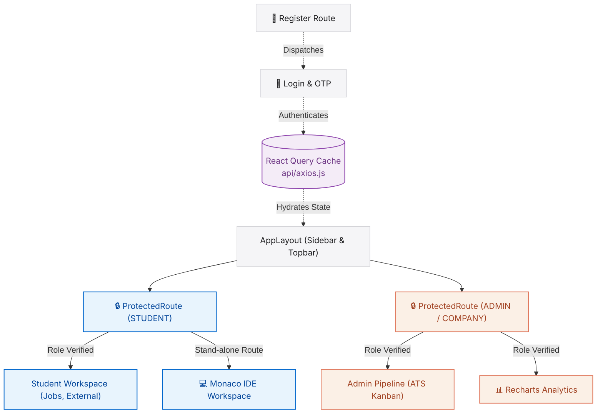

# 🚀 PlaceIQ Client — Premium React 19 Frontend

[](https://react.dev/)
[](https://vite.dev/)
[](https://tailwindcss.com/)
[](https://tanstack.com/query)
[](https://socket.io/)

🔗 **Live Production Deploy:** [placeiq-frontend.vercel.app](https://placeiq-frontend.vercel.app/)

Welcome to the **PlaceIQ Frontend Client**—a premium, enterprise-grade React 19 Single Page Application (SPA) designed to serve as the highly interactive command center for the **PlaceIQ Smart Placement Tracking Portal**.

This client application is meticulously engineered around a glassmorphic aesthetic, strict layout constraints, crisp typography, and fluid micro-animations powered by Framer Motion. It operates seamlessly in multi-role environments (`student`, `admin`, `company`, `alumni`), offering instant state synchronization via TanStack Query, real-time WebSocket alerts, role-isolated dashboards, and an embedded Monaco code editor.

---

## 💎 Core Architecture Highlights

### 1. Advanced Role-Based Routing & Guards (`src/components/common/ProtectedRoute.jsx`)
Client routes are guarded at the component level to ensure strict isolation:
* **Granular Permissions:** Supports array-based permissions checking against the decoded JWT user role (e.g., `roles={['admin']}`).
* **Seamless Interception:** Authenticates first; if a student attempts to navigate to recruiter endpoints, they are seamlessly redirected to `/unauthorized` to prevent unauthorized access.

### 2. State Hydration & API Interception (`src/api/axios.js`)
Powered by an Axios interceptor pattern coupled with **TanStack React Query**:
* **Token Reconciliation:** On every request, a request interceptor automatically retrieves the JWT from `localStorage` and attaches it to the `Authorization` header.
* **Instant Logout Cleanup:** A response interceptor watches for `401 Unauthorized` responses. If triggered, it purges local caches and forces a secure redirect to the login page.
* **Declarative Fetching:** React Query handles caching, background refetching, and deduping, ensuring the UI is always perfectly in sync with the database without redundant network waterfalls.

### 3. Real-Time WebSocket Engine (`src/hooks/useSocket.jsx`)
* **Dynamic Room Subscriptions:** Upon authentication, users are subscribed to private Socket.io rooms based on their specific User ID, while administrators join a global `room:admins` channel.
* **Live Micro-Interactions:** Receives events like `application:status_changed` and triggers highly-stylized, glassmorphic toast notifications globally without requiring page reloads.

### 4. Interactive ATS Pipeline & IDE Workspace
* **Drag-and-Drop ATS:** Utilizes `@dnd-kit/core` to render fluid, interactive Kanban boards for admins to seamlessly transition candidate application stages.
* **Embedded Coding Canvas:** A standalone route (`AssessmentWorkspace.jsx`) strips away sidebars, rendering a full-screen **Monaco Editor** for distraction-free technical programming assessments.

---

## 🗺️ Client Navigation & State Architecture

This diagram visualizes the application's page structure, route protection, and real-time state synchronization:



---

## 📂 Project Directory Structure

```text
client/
├── src/
│   ├── api/                # Axios configuration and global JWT interceptors
│   ├── assets/             # Static media and brand assets
│   ├── components/         # Reusable UI elements
│   │   ├── common/         # Shared wrappers (ProtectedRoute)
│   │   ├── layout/         # AppLayout, Sidebar, Topbar components
│   │   └── ui/             # Glassmorphic inputs, badges, spinners
│   ├── hooks/              # Custom context hooks (useAuth, useSocket)
│   ├── lib/                # Utility mergers (tw.js for Tailwind classes)
│   ├── pages/              # Routable view components separated by user role
│   │   ├── admin/          # TPO Dashboard, Kanban, Bulk Upload
│   │   ├── company/        # HR Job Postings, Assessments
│   │   └── student/        # Candidate Profile, IDE, External Jobs
│   ├── App.jsx             # Main React Router definitions
│   └── main.jsx            # DOM mounting and Context Providers
├── .env.production         # Vercel production environment variables
├── tailwind.config.js      # Custom theme and animation config
└── vite.config.js          # Vite build pipeline config
```
