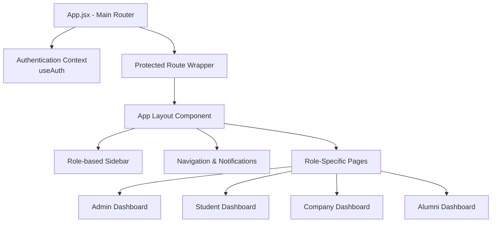
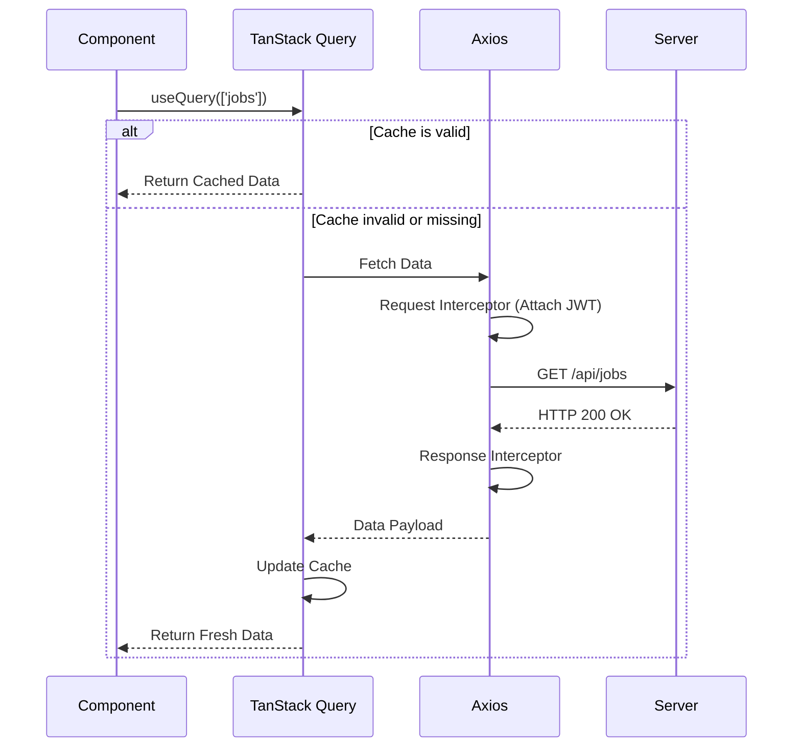
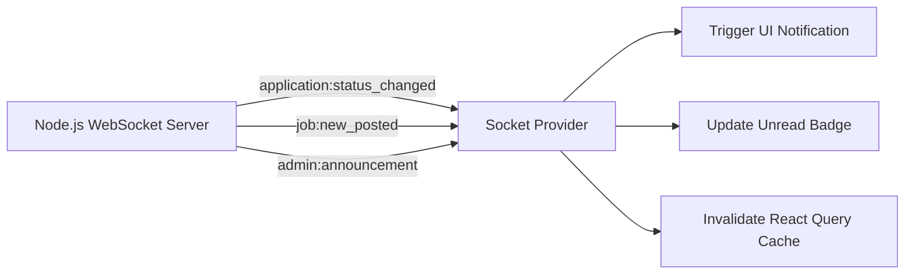

# PlaceIQ Frontend Documentation

## Overview

The PlaceIQ frontend is a robust Single Page Application (SPA) built with React 19 and Vite. It serves as the primary interface for Students, Administrators (TPOs), Companies, and Alumni, featuring real-time data synchronization, a drag-and-drop Kanban interface, and an embedded code editor.

## Technology Stack

- **Framework**: React 19
- **Build Tool**: Vite
- **Styling**: Tailwind CSS 4.0
- **State Management & Data Fetching**: TanStack React Query (v5)
- **Real-time Communication**: Socket.io Client
- **Interactive UI Components**: 
  - `@dnd-kit` for Kanban boards
  - `framer-motion` for transitions
  - `@monaco-editor/react` for the assessment IDE
  - `recharts` for analytics dashboards
- **Routing**: React Router DOM (v7)

## Frontend Architecture

The application implements a modular component architecture with strict role-based route protection.



## Data Fetching and State Synchronization

The client utilizes TanStack Query for caching and synchronizing server state, coupled with an Axios instance handling interceptors for authentication.



## Real-time WebSocket Implementation

The `useSocket` context provider initializes the Socket.io connection and manages real-time event listeners.



## Directory Structure

```text
client/src/
├── api/              # Axios configuration and interceptors
├── assets/           # Static media assets
├── components/       # Reusable UI elements
│   ├── common/       # Shared components (ProtectedRoute)
│   ├── layout/       # Structural components (AppLayout, Sidebar)
│   └── ui/           # Base elements (Buttons, Spinners)
├── hooks/            # Custom React hooks (useAuth, useSocket)
├── lib/              # Utility functions (Tailwind class mergers)
├── pages/            # Routable view components separated by role
└── main.jsx          # Application entry point
```

## Development Commands

- `npm run dev`: Starts the Vite development server.
- `npm run build`: Bundles the application for production deployment.
- `npm run preview`: Serves the production build locally for testing.
- `npm run lint`: Executes ESLint for code quality analysis.
