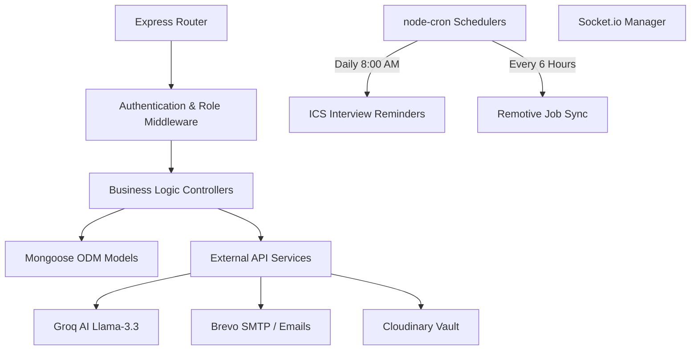
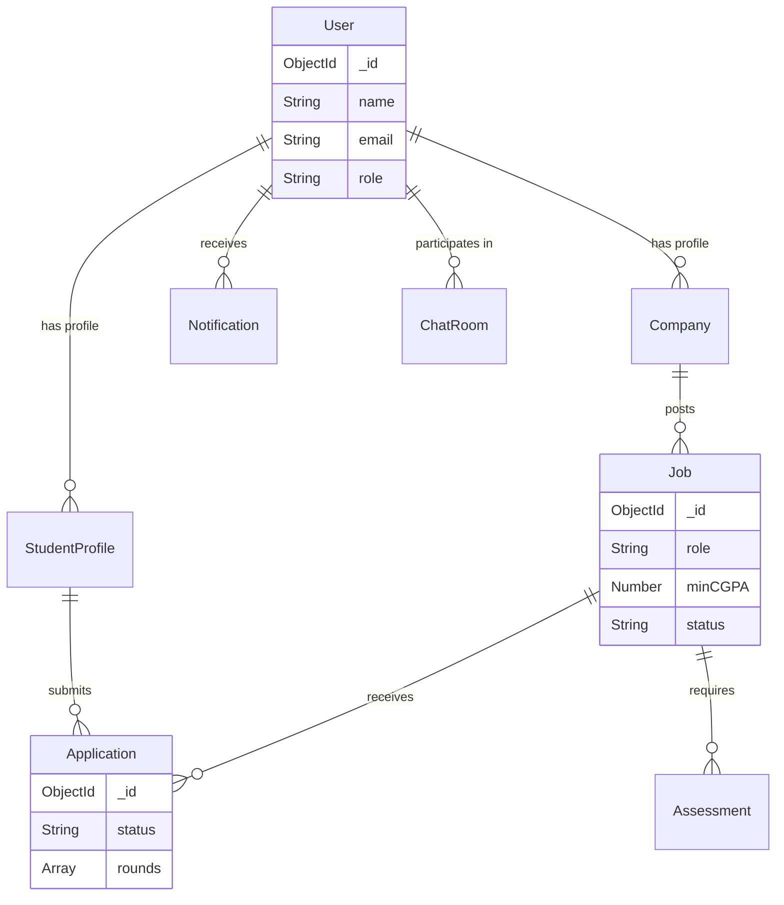
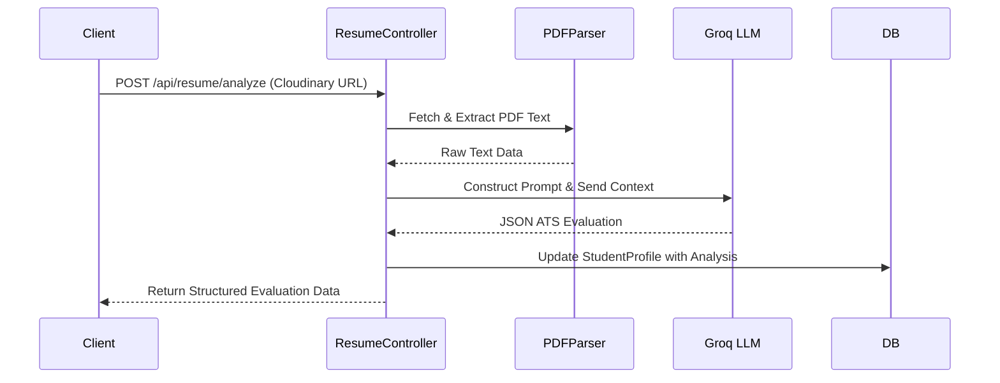
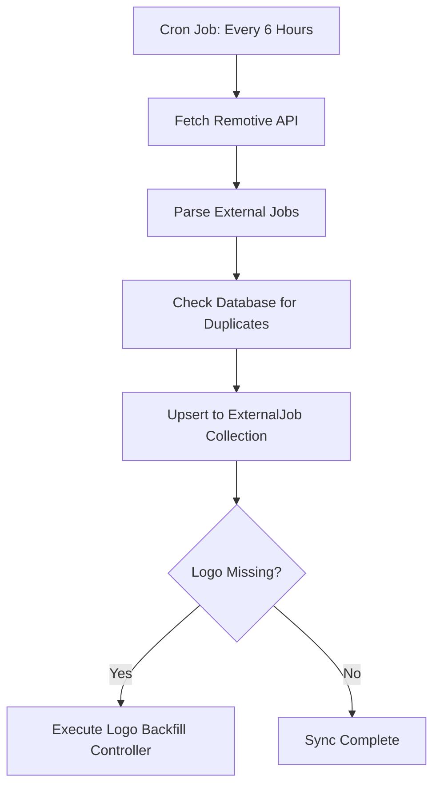

# PlaceIQ Backend Engineering Documentation

The PlaceIQ backend is a modular, high-performance RESTful API and WebSocket server built with Node.js and Express. It serves as the intelligent core of the platform, managing complex relational data via MongoDB, orchestrating automated background scheduling, and integrating securely with external AI and email microservices.

## 🔗 Live Deployment
- **API Server**: [https://placeiq-smart-placement.onrender.com](https://placeiq-smart-placement.onrender.com)

## 🛠️ Core Technology Stack

- **Runtime & Framework**: Node.js utilizing Express.js for fast, modular HTTP routing.
- **Database & ODM**: MongoDB Atlas cluster queried via the strict-schema Mongoose ODM.
- **Real-Time Server**: Socket.io enabling persistent, bidirectional TCP connections for live alerts.
- **Background Automation**: `node-cron` driving scheduled tasks and periodic API crawls.
- **AI Intelligence Layer**: Groq SDK interacting with the Llama-3.3-70b-versatile model to evaluate student resumes.
- **Document Processing**: `pdf-parse` for text extraction from candidate uploads, and `pdfkit` to compile printable resumes.
- **Communication & Mailing**: Nodemailer configured with Brevo SMTP for transactional emails, paired with `ics` to attach standard calendar sync files.
- **Data Export**: `exceljs` and `xlsx` for parsing bulk student uploads and generating administrative placement reports.
- **Cloud Storage**: Multer and Cloudinary securely handle company logo and document uploads.

## 🏛️ System Architecture

The backend adheres to a strict Controller-Service-Model paradigm. Incoming HTTP requests pass through security middleware (JWT validation and RBAC checks) before hitting business logic controllers, ensuring protected operations.



## 🗄️ Database Entity Relationship Models

The system relies on highly relational Mongoose schemas to track the placement lifecycle.

- **User**: Manages roles, secure bcrypt-hashed passwords, and OTP verification states.
- **StudentProfile**: Houses CGPA, active backlogs, skills arrays, and AI-generated ATS analysis logs.
- **Job**: Stores job requirements (branches allowed, minimum grades) and administrative approval status.
- **Application**: Links a Student to a Job, housing a complex `rounds` sub-document array tracking individual interview scores, feedback, and scheduled times.
- **Assessment**: Configures coding environments, maintaining test cases and student code submissions.



## 🔄 Core Backend Workflows

### 1. AI Resume Analysis Flow
When a student triggers an ATS check, the backend orchestrates a multi-step sequence to parse, analyze, and store the evaluation.



### 2. Automated Background Schedulers (`node-cron`)
The backend operates autonomous routines to keep data fresh and users informed.
- **External Job Sync**: Every 6 hours, the server queries the Remotive API, de-duplicates records against the database, and backfills missing company logos.
- **Interview Reminders**: Every morning at 8:00 AM, the database is scanned for candidate interviews scheduled within the next 24 hours. The system generates `.ics` calendar invites and emails them out to ensure zero missed appointments.



## 🌐 API Endpoint Summary Reference

- `/api/auth`: Handles secure registration, login, OTP dispatches, and token verification.
- `/api/students`: Manages student profile updates and resume uploads to Cloudinary.
- `/api/jobs`: Coordinates job creation, administrative approvals, and eligibility filtering.
- `/api/applications`: Submits applications and manipulates ATS Kanban stages.
- `/api/admin`: Compiles system-wide analytics, handles Excel bulk uploads, and exports placement lists.
- `/api/companies`: Manages corporate verification and profile administration.
- `/api/resume`: Executes AI parsing, scoring algorithms, and dynamic PDF resume generation.
- `/api/chat`: establishes peer-to-peer messaging rooms and retrieves chat histories.
- `/api/notifications`: Retrieves and acknowledges persistent user alerts.
- `/api/external-jobs`: Accesses the locally cached database of remote opportunities.
- `/api/assessments`: Provisions coding challenges and securely processes candidate code submissions.

## 🔐 Environment Configuration

To run the backend locally, create a `.env` file at the root of the `server/` directory and populate it with the following required keys:

```env
PORT=5000
NODE_ENV=development
CLIENT_URL=http://localhost:5173

MONGO_URI=mongodb_atlas_connection_string

JWT_SECRET=secure_jwt_secret
JWT_EXPIRE=7d
JWT_COOKIE_EXPIRE=7

CLOUDINARY_CLOUD_NAME=your_cloud_name
CLOUDINARY_API_KEY=your_api_key
CLOUDINARY_API_SECRET=your_api_secret

EMAIL_FROM=system@domain.com
EMAIL_FROM_NAME="PlaceIQ System"
BREVO_API_KEY=your_brevo_smtp_key

GROQ_API_KEY=your_groq_api_key
```
