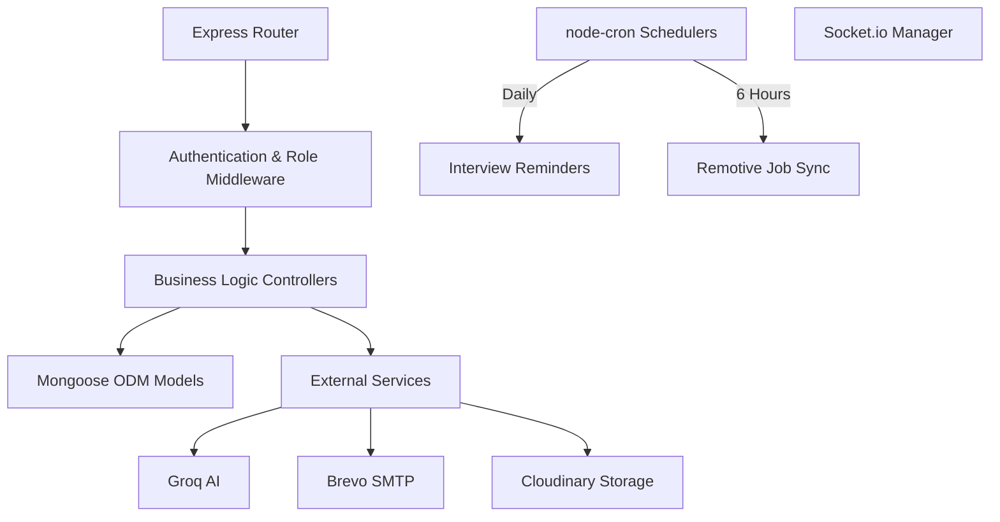
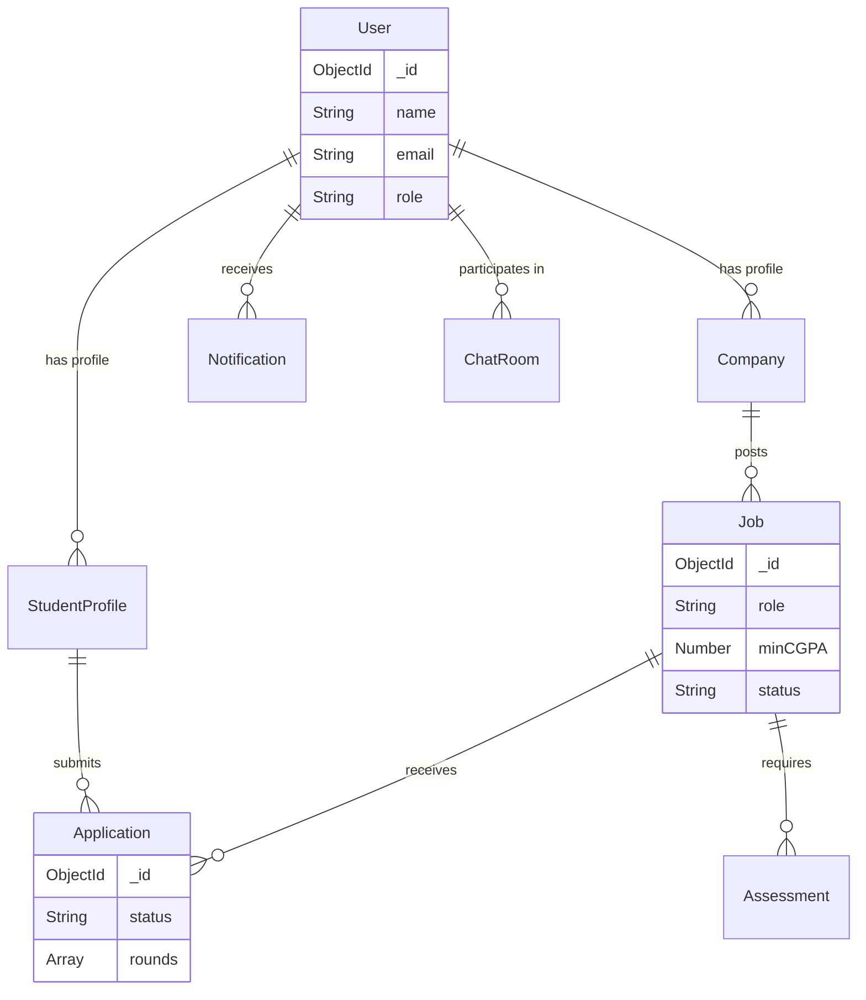
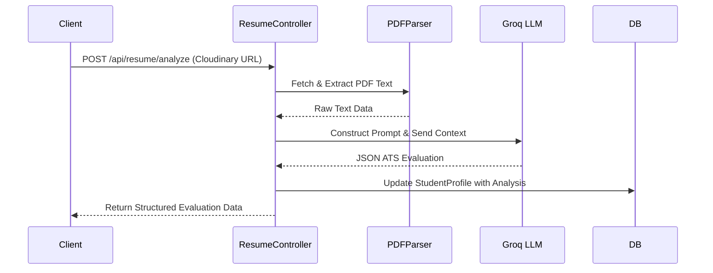
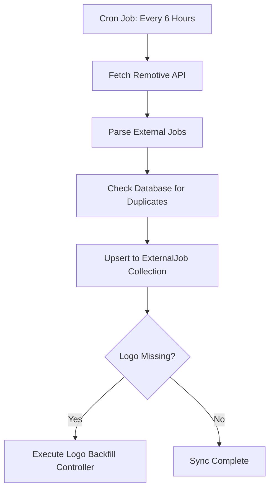

# PlaceIQ Backend Documentation

## Overview

The PlaceIQ backend is a modular RESTful API and WebSocket server built with Node.js and Express. It manages relational data structures via MongoDB, orchestrates background automation tasks, and integrates with external AI and email services.

## Technology Stack

- **Runtime & Framework**: Node.js, Express.js
- **Database & ODM**: MongoDB Atlas, Mongoose
- **Real-time Server**: Socket.io
- **Task Scheduling**: `node-cron`
- **AI Integration**: Groq SDK (Llama-3.3-70b-versatile)
- **Document Processing**: `pdf-parse` (Extraction), `pdfkit` (Generation)
- **Email & Notifications**: Nodemailer (Brevo SMTP), `ics` (Calendar sync)
- **Data Export**: `exceljs`, `xlsx`
- **File Storage**: Cloudinary (via Multer)

## System Architecture

The backend follows a Controller-Service-Model architecture with comprehensive middleware for authentication and error handling.



## Database Entity Relationship

The system utilizes a relational structure within MongoDB.



## Core Backend Workflows

### AI Resume Analysis Flow



### Automated Job Synchronization



## API Endpoint Summary

- `/api/auth`: Registration, login, OTP verification, and password resets.
- `/api/students`: Profile management and resume processing.
- `/api/jobs`: Job creation, filtering, and administration.
- `/api/applications`: Application submission and ATS round management.
- `/api/admin`: System analytics, bulk uploads, and data exports.
- `/api/companies`: Corporate profile verification and management.
- `/api/resume`: AI parsing, scoring, and PDF generation.
- `/api/chat`: Peer-to-peer real-time messaging data.
- `/api/notifications`: Alert persistence and retrieval.
- `/api/external-jobs`: Access synchronized remote opportunities.
- `/api/assessments`: Examination configurations and code submissions.

## Environment Configuration

Create a `.env` file in the `server` directory using the following template:

```env
PORT=5000
NODE_ENV=development
CLIENT_URL=http://localhost:5173

MONGO_URI=mongodb_atlas_connection_string

JWT_SECRET=secure_jwt_secret
JWT_EXPIRE=7d
JWT_COOKIE_EXPIRE=7

CLOUDINARY_CLOUD_NAME=your_cloud_name
CLOUDINARY_API_KEY=your_api_key
CLOUDINARY_API_SECRET=your_api_secret

EMAIL_FROM=system@domain.com
EMAIL_FROM_NAME="PlaceIQ System"
BREVO_API_KEY=your_brevo_smtp_key

GROQ_API_KEY=your_groq_api_key
```
