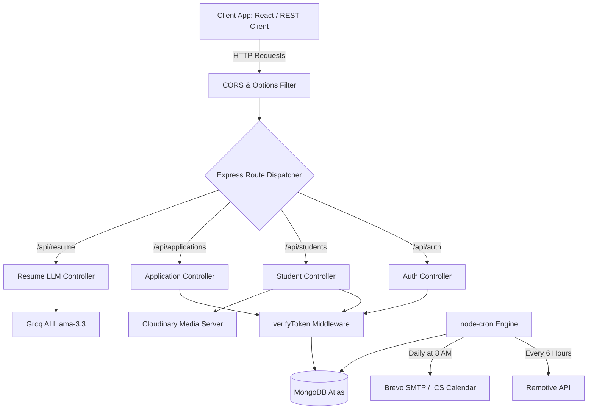

# PlaceIQ Backend - RESTful API & Real-Time Server

[](https://nodejs.org/)
[](https://expressjs.com/)
[](https://www.mongodb.com/)
[](https://socket.io/)

Live Production Deployment (Render): https://placeiq-smart-placement.onrender.com

The PlaceIQ backend provides a secure REST API and real-time WebSocket connection to handle authentication, data persistence, file assets, automated schedules, and LLM text analysis.

Built on Node.js and Express, the application routes traffic securely, checks authorization boundaries using JWT middleware, and connects to MongoDB Atlas using the Mongoose Object-Document Mapper (ODM).

---

## Tech Stack & Integrations

* **HTTP Runtime**: Node.js paired with Express.js for REST routing and middleware interceptors.
* **Persistence Gateway**: MongoDB Atlas with Mongoose schema modeling and relational data validators.
* **WebSocket Server**: Socket.io for multiplexed, bi-directional event broadcasts (announcements, status synchronization, messaging).
* **AI Analysis Pipeline**: Groq SDK integrations executing prompting commands against Llama-3.3 models.
* **Task Automation**: node-cron engine managing daily interview notification sweeps and periodic job crawls.
* **Document and File Svc**: Multer pipeline routing file uploads to Cloudinary storage vaults; PDF text parsing via pdf-parse.
* **Transactional Mailers**: Nodemailer and Brevo (SMTP) for sending verification OTPs, templates, and calendar ICS invites.

---

## Server Architecture Pipeline

This flowchart charts the request-response lifecycle from client applications down to local routers, validation middlewares, Mongoose models, and third-party integrations:



---

## Repository Code Layout

```text
server/
├── config/                # Database and integration setups (db.js)
├── controllers/           # Logical handlers managing endpoints
│   ├── authController.js  # Registration, login, OTP dispatch
│   ├── applicationController.js # ATS pipeline updates, assessments
│   └── resumeController.js# Groq API prompt assemblies and analysis
├── middleware/            # Security and validation pipelines
│   ├── authMiddleware.js  # JWT decoding, RBAC checks
│   └── errorMiddleware.js # Dynamic error serialization
├── models/                # Mongoose database schema definitions
│   ├── User.js            # Base credentials, role permissions
│   ├── Job.js             # Target criteria, branches, backlog limit
│   └── Application.js     # Links users to jobs, stores interview histories
├── routes/                # Express endpoint maps
├── utils/                 # Utilities and background jobs
│   ├── cronJobs.js        # Schedulers (Daily sweeps, Fetch intervals)
│   ├── jobFetcher.js      # Remotive integration handler
│   └── socketManager.js   # Room mapping, message routes
├── .env                   # Local configuration variables
├── server.js              # Application boot, database mount, middleware bindings
└── render.yaml            # Render infrastructure blueprints
```

---

## Configuration Requirements

Create a `.env` file in the root of the `server/` directory:

```env
PORT=5000
NODE_ENV=development
CLIENT_URL=http://localhost:5173

# Database configuration
MONGO_URI=your_mongodb_connection_string

# Authentication parameters
JWT_SECRET=your_jwt_signature_secret_key
JWT_EXPIRE=7d
JWT_COOKIE_EXPIRE=7

# Cloudinary credentials
CLOUDINARY_CLOUD_NAME=your_cloudinary_cloud_name
CLOUDINARY_API_KEY=your_cloudinary_api_key
CLOUDINARY_API_SECRET=your_cloudinary_api_secret

# Brevo SMTP details
EMAIL_FROM=system@placeiq.com
EMAIL_FROM_NAME="PlaceIQ System"
BREVO_API_KEY=your_brevo_smtp_api_key

# Groq AI Parameters
GROQ_API_KEY=your_groq_llama3_api_key
```

---

## Database Schemas & Models

### 1. User Model (User.js)
Represents credentials, security parameters, and profile link pointers.

| Field | Type | Attributes | Description |
| :--- | :--- | :--- | :--- |
| `name` | String | Required | Full name of the user |
| `email` | String | Required, Unique | Active email address |
| `password` | String | Required | Hash generated using bcryptjs (10 salts) |
| `role` | String | Enum | Permissions: student, admin, company, alumni |
| `otpCode` | String | Optional | 6-digit session activation token |

### 2. Job Model (Job.js)
Represents placement opportunities and candidate eligibility boundaries.

| Field | Type | Attributes | Description |
| :--- | :--- | :--- | :--- |
| `companyId` | ObjectId | Ref: User | Creator identifier |
| `role` | String | Required | Structural designation (e.g. Software Engineer) |
| `minCGPA` | Number | Default: 0 | Threshold grade eligibility check |
| `allowedBranches`| Array[String]| Required | Eligible target disciplines (e.g. CSE, ECE) |
| `status` | String | Default: 'pending'| Authorization status before vacancy is public |

### 3. Application Model (Application.js)
Handles the student application pipeline states.

| Field | Type | Attributes | Description |
| :--- | :--- | :--- | :--- |
| `studentId` | ObjectId | Ref: User | Applicant reference |
| `jobId` | ObjectId | Ref: Job | Job reference |
| `status` | String | Enum | Current stage (e.g. applied, shortlisted, placed) |
| `rounds` | Array[Object] | Sub-schema | Chronological log of round updates, scores, and feedback |
