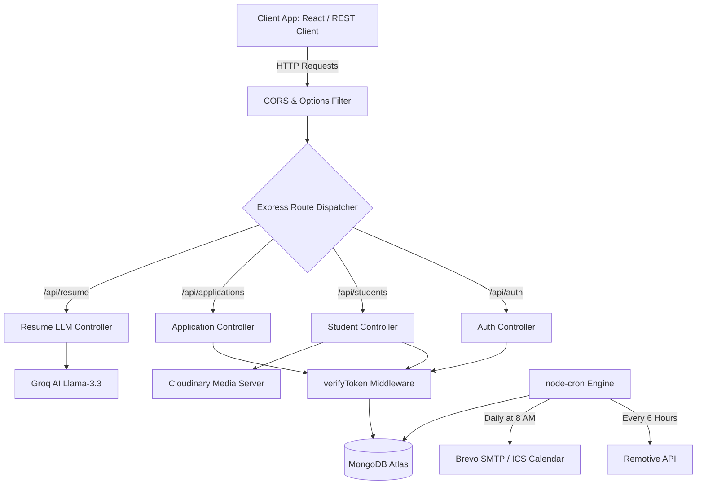

# PlaceIQ Backend - RESTful API & Real-Time Server

[](https://nodejs.org/)
[](https://expressjs.com/)
[](https://www.mongodb.com/)
[](https://socket.io/)

Live Production Deployment: https://placeiq-smart-placement.onrender.com

The PlaceIQ backend is a modular, high-performance Node.js API and WebSocket server. It serves as the business logic, storage, automation, and intelligence core for the PlaceIQ Smart Placement Tracking Portal. 

The backend architecture is structured around standard REST routing, Mongoose-backed database models, real-time message rooms, cron-based automation pipelines, and AI resume evaluation microservices.

---

## Technical Stack & Integrations

* **Core Runtime**: Node.js utilizing Express.js for REST routing and middleware interceptors.
* **Database & ODM**: MongoDB Atlas managed via Mongoose Object-Document Mapper (ODM) for validation schemas and population.
* **WebSocket Svc**: Socket.io for multiplexed, bi-directional event broadcasts (announcements, real-time status sync, and chat messaging).
* **AI Engine**: Groq SDK communicating with the Llama-3.3-70b-versatile model to evaluate resume documents.
* **Task Automation**: node-cron engine running background Remotive API crawls and daily email alerts.
* **Document and File Svc**: Multer pipeline routing file uploads to Cloudinary storage; PDF text parser (pdf-parse); printable resumes compiler (pdfkit).
* **Communication & Mailers**: Nodemailer configured with Brevo (SMTP) for sending verification OTPs, HTML email campaigns, and calendar invite attachments using the ICS module.
* **Data Exporter**: ExcelJS for processing bulk spreadsheet student enrollments and exporting analytics reports.

---

## Detailed Directory and File Reference

This section details the structure and responsibilities of every file and folder inside the `server/` directory.

### 1. Database Connections (config/)
* **db.js**: Connects to the MongoDB Atlas cluster using Mongoose. Logs status logs on startup and handles disconnect fallbacks.

### 2. Business Logic controllers (controllers/)
* **adminController.js**: Handles system analytics, logs audits, compiles statistics, manages recruiter requests, and processes bulk student roster spreadsheets.
* **applicationController.js**: Processes job applications, manages stage transitions inside the Kanban pipeline, and emits Socket notifications on updates.
* **assessmentController.js**: Controls programming assessment setup, records test cases, compiles student submissions, and returns run metrics.
* **auditController.js**: Retrieves historical audit records showing administrator actions.
* **authController.js**: Manages user registration, triggers verification OTPs, validates sessions, issues JWTs, and handles password resets.
* **campaignController.js**: Manages email notification dispatches and campus-wide alerts created by TPOs.
* **chatController.js**: Initializes chat rooms, records messages, tracks typing events, and checks message histories.
* **companyController.js**: Manages recruiter profile data, verifies company registration status, and posts company logos.
* **eventController.js**: Creates calendar schedules for campus interview presentations and recruitment drives.
* **externalJobController.js**: Manages external jobs cached from the Remotive API and backfills missing company logos.
* **jobController.js**: Processes job creation inputs, tracks applicant eligibility filters, and handles administrator approvals.
* **notificationController.js**: Dispatches, retrieves, and updates status flags for persistent user notifications.
* **referralController.js**: Coordinates alumni referral posts and maps candidate submissions.
* **resumeController.js**: Extracts text buffers from resume PDFs using pdf-parse, constructs custom prompts for Groq LLMs, parses ATS scores, and generates printable resumes via pdfkit.
* **slotController.js**: Manages interview scheduling calendars, books recruiter time, and records time allocations.
* **studentController.js**: Formulates student profiles, logs skill records, tracks CGPA, and manages resumes.

### 3. Middleware Pipelines (middleware/)
* **authMiddleware.js**: Verifies JSON Web Tokens extracted from HTTP-only cookies or authorization headers. Implements role checks to prevent unauthorized access.
* **errorMiddleware.js**: Catches uncaught controller exceptions and serializes errors into standardized JSON responses.

### 4. Service Utilities & Cron Engines (utils/)
* **apiFeatures.js**: Adds search, filter, and pagination behaviors to Mongoose queries.
* **auditHelper.js**: Writes audit records showing user IDs, actions, entities, changes, and timestamps.
* **cronJobs.js**: Initializes background schedules. Includes a 6-hour fetch routine for Remotive and a daily morning sweep for interview alerts.
* **generateToken.js**: Issues encrypted JWT structures using JWT secrets and expiry guidelines.
* **googleCalendar.js**: Coordinates synchronization hooks with Google API calendar schedules.
* **jobFetcher.js**: Crawls the Remotive API, parses job descriptions, sanitizes properties, and deduplicates database records.
* **multerConfig.js**: Manages Multer memory storage buffers, enforces file format filters, and handles Cloudinary uploads.
* **sendEmail.js**: Binds Nodemailer with Brevo SMTP, formatting HTML templates and building calendar ICS attachments.
* **slackWebhook.js**: Dispatches diagnostic alerts and system updates to connected Slack channels.
* **socketManager.js**: Exposes the WebSocket dispatcher, mapping active socket connections to private rooms.

---

## Server Request Pipeline

This chart tracks the lifecycle of requests from client platforms down to controllers, services, database models, and external microservices:



---

## API Routing Reference Catalog

The REST API exposes the following resource boundaries. Endpoint paths must be prefixed with the `/api` root.

### Authentication Endpoints (routes/authRoutes.js)
* `POST /auth/register`: Submits user registration details, triggering an activation OTP email.
* `POST /auth/verify-otp`: Confirms OTP credentials, updates active status, and sets the session JWT.
* `POST /auth/login`: Validates user credentials, returning token structures.
* `POST /auth/forgot-password`: Requests password resets, generating verification tokens.
* `POST /auth/reset-password`: Performs password updates using OTP validation.

### Candidate Management (routes/studentRoutes.js)
* `GET /students/profile`: Retrieves the active student profile.
* `PUT /students/profile`: Updates academic records, skills lists, and social links.
* `POST /students/upload-resume`: Uploads a PDF resume to Cloudinary.

### In-House Job Drives (routes/jobRoutes.js)
* `POST /jobs/create`: Recruiter submits a job posting with branch constraints and grade filters.
* `GET /jobs/active`: Returns active placement listings.
* `PATCH /jobs/:id/status`: Administrators approve or reject job listings.

### Applications & Tracking (routes/applicationRoutes.js)
* `POST /applications/apply`: Student applies to a job vacancy.
* `PUT /applications/:id/stage`: Transitions candidate pipeline stages on the Kanban board.
* `POST /applications/:id/schedule`: Recruiter assigns interview times.

### Artificial Intelligence ATS Checks (routes/resumeRoutes.js)
* `POST /resume/analyze`: Extracts PDF text and fetches ATS scores and keyword reviews from the Groq API.
* `GET /resume/generate-pdf`: Compiles candidate profile fields into formatted PDF resumes.

---

## Database Schemas & Data Models (models/)

### 1. User Model (User.js)
Represents credentials, roles, and session keys.

| Field | Type | Attributes | Description |
| :--- | :--- | :--- | :--- |
| `name` | String | Required | Full name of the user account owner |
| `email` | String | Required, Unique | The email address used for login |
| `password` | String | Required | Encrypted password string |
| `role` | String | Enum | Privileges: student, admin, company, alumni |
| `otpCode` | String | Optional | The 6-digit verification code |
| `otpExpires`| Date | Optional | Expiry timestamp for the OTP code |

### 2. StudentProfile Model (StudentProfile.js)
Tracks candidate data, academics, and resume files.

| Field | Type | Attributes | Description |
| :--- | :--- | :--- | :--- |
| `userId` | ObjectId | Ref: User, Unique | Link to parent account |
| `cgpa` | Number | Required, Min: 0, Max: 10 | Current academic performance score |
| `backlogs` | Number | Required, Default: 0 | Total unresolved backlog count |
| `branch` | String | Required | Engineering discipline (e.g. CSE, ECE) |
| `resumeUrl` | String | Optional | File link on Cloudinary |
| `atsReview` | Object | Optional | JSON payload detailing Groq AI analysis scores |

### 3. Job Model (Job.js)
Stores recruitment criteria and approval flags.

| Field | Type | Attributes | Description |
| :--- | :--- | :--- | :--- |
| `companyId` | ObjectId | Ref: User, Required | Recruiter account that created the listing |
| `role` | String | Required | The job designation title |
| `minCGPA` | Number | Default: 0 | Candidate minimum grade filter |
| `allowedBranches`| Array[String] | Required | List of allowed academic disciplines |
| `maxBacklogs`| Number | Default: 0 | Maximum backlogs allowed for candidates |
| `status` | String | Enum, Default: pending | Approval state: pending, active, completed |

### 4. Application Model (Application.js)
Tracks candidate stage changes and interview records.

| Field | Type | Attributes | Description |
| :--- | :--- | :--- | :--- |
| `studentId` | ObjectId | Ref: User, Required | Candidate reference |
| `jobId` | ObjectId | Ref: Job, Required | Applied vacancy reference |
| `status` | String | Enum | Stages: applied, test, interview, hr, placed |
| `rounds` | Array | Sub-schema | Array log tracking round dates, feedback, and scores |

---

## Configuration Requirements

Create a `.env` file in the root of the `server/` directory and set the variables below:

```env
PORT=5000
NODE_ENV=development
CLIENT_URL=http://localhost:5173

MONGO_URI=your_mongodb_connection_string

JWT_SECRET=your_jwt_signature_secret_key
JWT_EXPIRE=7d
JWT_COOKIE_EXPIRE=7

CLOUDINARY_CLOUD_NAME=your_cloudinary_cloud_name
CLOUDINARY_API_KEY=your_cloudinary_api_key
CLOUDINARY_API_SECRET=your_cloudinary_api_secret

EMAIL_FROM=system@placeiq.com
EMAIL_FROM_NAME="PlaceIQ System"
BREVO_API_KEY=your_brevo_smtp_api_key

GROQ_API_KEY=your_groq_llama3_api_key
```
