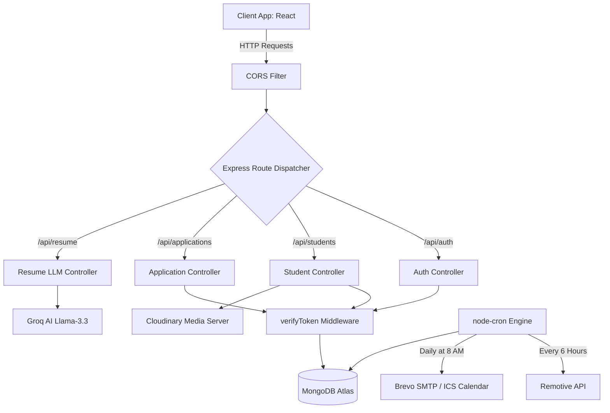

# 🚀 PlaceIQ Backend - MERN Placement API

[](https://nodejs.org/)
[](https://expressjs.com/)
[](https://www.mongodb.com/)
[](https://socket.io/)

🔗 **Live Production Deploy:** [placeiq-smart-placement.onrender.com](https://placeiq-smart-placement.onrender.com/)

A robust, enterprise-grade, secure RESTful API built on the MERN stack for the **PlaceIQ Placement Portal**. This API supports OTP authentication, rich role-based access control (RBAC), secure media uploads via Cloudinary, automated background crons, and AI-powered LLM integrations via Groq SDK.

---

## 🛠️ Tech Stack & Key Integrations

*   **Core Server Framework:** Node.js & Express
*   **Database & Object Modeling:** MongoDB & Mongoose (Schema validation, populated relations, strict querying)
*   **Real-Time Gateway:** Socket.io for multiplexed bidirectional TCP events (Chat, Notifications)
*   **Security & Encryption:** JWT (JSON Web Tokens) with Cookie/Header authorization support, bcryptjs (salt password hashing)
*   **AI Integration:** Groq SDK utilizing `llama-3.3-70b-versatile` for ATS resume text parsing and scoring
*   **Media Hosting & Storage:** Cloudinary API integrated with Multer
*   **Task Automation:** `node-cron` for 6-hour Remotive job crawls and 8:00 AM daily interview ICS alerts
*   **Reporting:** `exceljs` for exporting admin analytics, `pdfkit` for candidate resume generation

---

## 🏗️ Architecture & Flow Diagram

The following architecture diagram represents the request-response lifecycle from the client app down to the database, cron schedulers, and external cloud integrations:



---

## 📂 Project Directory Structure

Here is a high-level mapping of the backend codebase:

```text
server/
├── config/                # Service Integrations & Configurations
│   └── db.js              # MongoDB Atlas connection wrapper
├── controllers/           # Business Logic & Core Handlers
│   ├── authController.js  # Registration, OTP dispatch, JWT issuance
│   ├── applicationController.js # ATS pipeline updates, interview scheduling
│   └── resumeController.js# LLM context prompting and pdfkit generators
├── middleware/            # Global Express interceptors
│   ├── authMiddleware.js  # JWT decoding and RBAC verification
│   └── errorMiddleware.js # Standardized error JSON formatting
├── models/                # Mongoose Database Schemas
│   ├── UserModel.js       # Core accounts, roles, bcrypt hashing
│   ├── Job.js             # Vacancy criteria and constraints
│   └── Application.js     # Embedded interview rounds sub-documents
├── routes/                # REST API Endpoint definitions
├── utils/                 # Utilities and Background Jobs
│   ├── cronJobs.js        # Scheduled routines (Reminders, APIs)
│   ├── jobFetcher.js      # Remotive API sanitization and upserts
│   └── socketManager.js   # WebSocket room bindings and presence
├── .env                   # Local configuration variables
├── server.js              # Application entry point, CORS config, Port bind
└── render.yaml            # Render infrastructure deployment file
```

---

## 🔑 Environment Configuration

To run this backend, create a `.env` file in the root folder of the `server/` directory:

```ini
# Application Running Port
PORT=5000
NODE_ENV=development
CLIENT_URL=http://localhost:5173

# Database Connection string (MongoDB Atlas)
MONGO_URI=your_mongodb_connection_string

# Encryption secrets
JWT_SECRET=your_jwt_signature_secret_key
JWT_EXPIRE=7d
JWT_COOKIE_EXPIRE=7

# Cloudinary Integration API credentials
CLOUDINARY_CLOUD_NAME=your_cloudinary_cloud_name
CLOUDINARY_API_KEY=your_cloudinary_api_key
CLOUDINARY_API_SECRET=your_cloudinary_api_secret

# Brevo Mailer Gateway (SMTP)
EMAIL_FROM=system@placeiq.com
EMAIL_FROM_NAME="PlaceIQ System"
BREVO_API_KEY=your_brevo_smtp_api_key

# Groq AI Integration
GROQ_API_KEY=your_groq_llama3_api_key
```

---

## 📦 Database Schemas & Data Models

### 1. User Model (`User.js`)
Represents students, corporate HRs, alumni, and administrators.

| Field | Type | Attributes | Description |
| :--- | :--- | :--- | :--- |
| `name` | String | Required | Full name of the account owner |
| `email` | String | Required, Unique | Email address used for authentication |
| `password` | String | Required | Bcrypt-hashed password string |
| `role` | String | Enum | System privilege (`student`, `admin`, `company`, `alumni`) |
| `otpCode` | String | Optional | 6-digit verification code |

### 2. Job Model (`Job.js`)
Represents campus recruitment drives and corporate vacancies.

| Field | Type | Attributes | Description |
| :--- | :--- | :--- | :--- |
| `companyId` | ObjectId | Ref: User | The corporate account that posted the job |
| `role` | String | Required | Job Title / Designation |
| `minCGPA` | Number | Default: 0 | Strict filter blocking unqualified students |
| `allowedBranches`| Array[String] | Required | Target engineering branches (e.g. `CSE`, `ECE`) |
| `status` | String | Default: 'pending'| Admin approval state before going public |

### 3. Application Model (`Application.js`)
Links a student to a job, tracking their ATS progression.

| Field | Type | Attributes | Description |
| :--- | :--- | :--- | :--- |
| `studentId` | ObjectId | Ref: User | Candidate identifier |
| `jobId` | ObjectId | Ref: Job | Target vacancy identifier |
| `status` | String | Enum | Current pipeline stage (`applied`, `shortlisted`, `placed`) |
| `rounds` | Array[Object] | Sub-schema | Historical log of interview assessments and scores |
